# 02 — System Architecture Overview

## 1. Design Philosophy

```
Aircraft State Engine (C++)
    ↓ authoritative source of truth
Systems Simulation Layer (C++)
    ↓ drives all avionics
Training Framework (C++)
    ↓ orchestrates modes/sessions
UI Presentation Layer (QML)
    ↓ visualizes and controls
```

**Rule**: The UI never computes aircraft state. It only reads from and sends commands to the backend.

---

## 2. High-Level Module Architecture

```mermaid
graph TB
    subgraph "Aircraft State Engine"
        ASE[AircraftStateEngine]
        ADC[AirDataComputer]
        FDM6[6DOF_FlightDynamics]
        GND[GroundModel]
        ENG[EngineModel_LEAP1A]
        AERO[AeroModel]
    end

    subgraph "Avionics Layer"
        FMGC1[FMGC_1]
        FMGC2[FMGC_2]
        FAC1[FAC_1]
        FAC2[FAC_2]
        SEC1[SEC_1]
        SEC2[SEC_2]
        SEC3[SEC_3]
        ELAC1[ELAC_1]
        ELAC2[ELAC_2]
        FCU[FCU]
        ADIRS[ADIRS_1_2_3]
        ECAM[ECAM_Computer]
        EGPWS_C[EGPWS_Computer]
        TCAS_C[TCAS_Computer]
        XPDR[Transponder]
    end

    subgraph "Navigation Layer"
        NAVDB[NavigationDatabase]
        ARINC[ARINC424_Parser]
        AIRAC[AIRAC_Manager]
        FPM[FlightPlanManager]
        PERF[PerformanceManager]
        PRED[PredictionEngine]
    end

    subgraph "Training Layer"
        TMF[TrainingModeFramework]
        ISE[InstructorStationEngine]
        FEM[FailureEngine]
        REC[RecordingEngine]
        ASSESS[AssessmentEngine]
        SCEN[ScenarioEngine]
    end

    subgraph "Data Bus"
        BUS[FlightDataBus]
    end

    subgraph "UI Layer - QML"
        PFD[PFD]
        ND[ND]
        MCDU_UI[MCDU]
        ECAM_UI[ECAM_Display]
        OHP[OverheadPanel]
        PED[Pedestal]
        FCU_UI[FCU_Panel]
        INST[InstructorUI]
    end

    ASE --> BUS
    FMGC1 --> BUS
    FMGC2 --> BUS
    FAC1 --> BUS
    ELAC1 --> BUS
    FCU --> BUS
    ADIRS --> BUS
    NAVDB --> FMGC1
    FPM --> FMGC1
    TMF --> BUS
    ISE --> FEM
    ISE --> REC
    BUS --> PFD
    BUS --> ND
    BUS --> MCDU_UI
    BUS --> ECAM_UI
    BUS --> OHP
```



---

## 3. Module Decomposition Plan

### Current → Target Mapping

| Current Class | Target Modules | Rationale |
|---------------|---------------|-----------|
| `AirDataComputer` (466 lines hdr) | `AircraftStateEngine` + `AirDataComputer` + `FlightDynamicsModel` + `AutopilotController` + `AutothrustController` + `FlightControlLaws` + `EngineModel` | SRP violation — one class does physics, AP, FBW, engines |
| `FlightDataManager` (282 lines hdr) | `FlightDataBus` + `SystemsManager` + `EFISController` | Mixes flight data, systems state, and EFIS config |
| `FMSComputer` (95 lines hdr) | `FMGC` + `MCDUInputHandler` + `FlightPlanManager` + `PerformanceManager` | MCDU I/O mixed with FMS logic |
| `InstructorEngine` (60 lines hdr) | `InstructorStationEngine` + `FailureEngine` + `ScenarioEngine` + `RecordingEngine` | All instructor functions in one thin class |
| `ArincParser` (45 lines hdr) | `NavigationDatabase` + `ARINC424Parser` + `AIRACManager` | No versioning or update support |

---

## 4. Data Bus Architecture

The `FlightDataBus` replaces the current `FlightDataManager` singleton with a structured, categorized bus:

```cpp
// Channel-based data bus
namespace DataBus {
    struct AircraftState {        // from AircraftStateEngine
        Position position;        // lat, lon, alt_geometric, alt_pressure, alt_radio
        Velocity velocity;        // ias, tas, gs, mach, vs
        Attitude attitude;        // pitch, roll, heading, track
        AngularRates rates;       // p, q, r
        AeroState aero;           // alpha, beta, nz, gamma
        Weight weight;            // mass, cg_mac_pct, fuel_per_tank[5]
        Atmosphere atmosphere;    // oat, tat, pressure, density, wind
    };

    struct AvionicsState {        // from FMGC/FCU/ADIRS
        AutopilotState ap;
        AutothrustState athr;
        FMAState fma;
        FlightPlan activePlan;
        PerformanceData perf;
        NavigationState nav;      // TOC, TOD, active waypoint
    };

    struct SystemsState {         // from SystemsManager
        HydraulicSystem hyd[3];   // Green, Blue, Yellow
        ElectricalSystem elec;
        PneumaticSystem pneu;
        FuelSystem fuel;
        PressurizationSystem press;
        FireProtection fire;
    };

    struct TrainingState {        // from TrainingModeFramework
        TrainingMode activeMode;
        SessionInfo session;
        FailureList activeFailures;
        AssessmentData assessment;
    };
}
```

---

## 5. Thread Architecture

```
┌─────────────────────────────────────────────────────┐
│ Main Thread (QML UI)                                 │
│  - All QML rendering (PFD, ND, MCDU, ECAM, OHP)    │
│  - User input handling                               │
│  - Reads DataBus via Q_PROPERTY bindings            │
└───────────────────────┬─────────────────────────────┘
                        │ Qt signal/slot (queued)
┌───────────────────────┴─────────────────────────────┐
│ Simulation Thread (80ms tick → 12.5 Hz)              │
│  - AircraftStateEngine::tick()                       │
│  - 6DOF integration (8 sub-steps × 10ms)            │
│  - Autopilot/Autothrust laws                        │
│  - Engine model                                      │
│  - Systems simulation                                │
│  - Writes to DataBus (mutex-protected)              │
└───────────────────────┬─────────────────────────────┘
                        │
┌───────────────────────┴─────────────────────────────┐
│ Navigation Thread (1 Hz)                             │
│  - Flight plan predictions                           │
│  - TOC/TOD recomputation                            │
│  - Fuel predictions                                  │
│  - AIRAC lookups                                     │
└───────────────────────┬─────────────────────────────┘
                        │
┌───────────────────────┴─────────────────────────────┐
│ Recording Thread (configurable rate)                 │
│  - State snapshots                                   │
│  - Event logging                                     │
│  - Async file/network I/O                           │
└─────────────────────────────────────────────────────┘
```

---

## 6. Build System Target

```cmake
cmake_minimum_required(VERSION 3.21)
project(FmsTrainer VERSION 2.0.0 LANGUAGES CXX)
set(CMAKE_CXX_STANDARD 20)  # Upgrade from 17

# Sub-libraries (each independently testable)
add_subdirectory(Core)           # Units, math, constants
add_subdirectory(Aircraft)       # 6DOF, aero, engine, ground
add_subdirectory(Avionics)       # FMGC, FCU, ADIRS, ECAM, FBW
add_subdirectory(Navigation)     # NavDB, ARINC424, AIRAC, FlightPlan
add_subdirectory(Training)       # Modes, instructor, recording, assessment
add_subdirectory(DataBus)        # Central data bus
add_subdirectory(Frontend)       # QML UI modules
add_subdirectory(Tests)          # Catch2/GoogleTest
```
