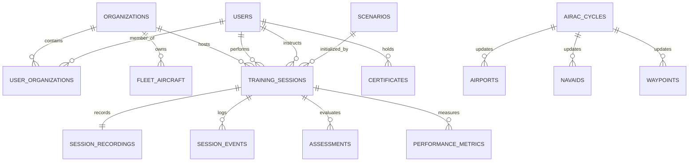

# 09 — Supabase Schema (Airline-Grade)

## New Tables Required (Beyond Existing 26)

### Organizations & Multi-Tenancy

```sql
-- ============================================================================
-- ORGANIZATIONS (Airlines, ATOs, Universities)
-- ============================================================================
CREATE TYPE org_type AS ENUM ('airline', 'ato', 'university', 'oem', 'training_center');

CREATE TABLE organizations (
    id UUID PRIMARY KEY DEFAULT gen_random_uuid(),
    name VARCHAR(255) NOT NULL,
    org_type org_type NOT NULL,
    icao_code VARCHAR(4),          -- airline ICAO (e.g., DLH, BAW)
    iata_code VARCHAR(3),
    country VARCHAR(2),
    logo_url TEXT,
    license_number VARCHAR(100),
    license_expiry DATE,
    config JSONB DEFAULT '{}'::jsonb,  -- org-specific settings
    is_active BOOLEAN DEFAULT true,
    created_at TIMESTAMPTZ DEFAULT NOW(),
    updated_at TIMESTAMPTZ DEFAULT NOW()
);

-- ============================================================================
-- USER ORGANIZATION MEMBERSHIP
-- ============================================================================
CREATE TABLE user_organizations (
    id UUID PRIMARY KEY DEFAULT gen_random_uuid(),
    user_id UUID NOT NULL REFERENCES users(id) ON DELETE CASCADE,
    organization_id UUID NOT NULL REFERENCES organizations(id) ON DELETE CASCADE,
    org_role VARCHAR(50) NOT NULL DEFAULT 'member',  -- admin, instructor, student, observer
    department VARCHAR(100),
    employee_id VARCHAR(50),
    joined_at TIMESTAMPTZ DEFAULT NOW(),
    UNIQUE(user_id, organization_id)
);
```

### Enhanced Users (Add to Existing)

```sql
ALTER TABLE users ADD COLUMN organization_id UUID REFERENCES organizations(id);
ALTER TABLE users ADD COLUMN type_ratings TEXT[] DEFAULT '{}';
ALTER TABLE users ADD COLUMN medical_expiry DATE;
ALTER TABLE users ADD COLUMN language VARCHAR(5) DEFAULT 'en';

-- Add new roles
ALTER TYPE user_role ADD VALUE 'examiner';
ALTER TYPE user_role ADD VALUE 'ato_admin';
ALTER TYPE user_role ADD VALUE 'observer';
```

### Fleet & Aircraft Management

```sql
-- ============================================================================
-- FLEET (Organization's Aircraft)
-- ============================================================================
CREATE TABLE fleet_aircraft (
    id UUID PRIMARY KEY DEFAULT gen_random_uuid(),
    organization_id UUID NOT NULL REFERENCES organizations(id) ON DELETE CASCADE,
    aircraft_config_id UUID REFERENCES aircraft_configurations(id),
    registration VARCHAR(10) NOT NULL,    -- e.g., D-AIUA
    tail_number VARCHAR(10),
    serial_number VARCHAR(20),
    delivery_date DATE,
    engine_variant VARCHAR(50),           -- LEAP-1A26, LEAP-1A32, PW1127G
    airline_config JSONB,                 -- seat config, galley layout, etc.
    is_active BOOLEAN DEFAULT true,
    created_at TIMESTAMPTZ DEFAULT NOW(),
    UNIQUE(organization_id, registration)
);
```

### AIRAC Cycle Management

```sql
-- ============================================================================
-- AIRAC CYCLES
-- ============================================================================
CREATE TABLE airac_cycles (
    id UUID PRIMARY KEY DEFAULT gen_random_uuid(),
    cycle_ident VARCHAR(4) NOT NULL UNIQUE,  -- e.g., "2613"
    effective_date DATE NOT NULL,
    expiration_date DATE NOT NULL,
    data_source VARCHAR(50),                  -- FAA CIFP, Jeppesen, etc.
    checksum VARCHAR(64),
    record_count INTEGER,
    is_current BOOLEAN DEFAULT false,
    is_next BOOLEAN DEFAULT false,
    loaded_at TIMESTAMPTZ DEFAULT NOW()
);

-- Navigation data linked to AIRAC cycle
ALTER TABLE airports ADD COLUMN airac_cycle_id UUID REFERENCES airac_cycles(id);
ALTER TABLE navigation_database ADD COLUMN airac_cycle_id UUID REFERENCES airac_cycles(id);
ALTER TABLE sids ADD COLUMN airac_cycle_id UUID REFERENCES airac_cycles(id);
ALTER TABLE stars ADD COLUMN airac_cycle_id UUID REFERENCES airac_cycles(id);
ALTER TABLE approaches ADD COLUMN airac_cycle_id UUID REFERENCES airac_cycles(id);
ALTER TABLE airways ADD COLUMN airac_cycle_id UUID REFERENCES airac_cycles(id);
```

### Failure Library (Persistent)

```sql
-- ============================================================================
-- FAILURE DEFINITIONS
-- ============================================================================
CREATE TYPE failure_category AS ENUM (
    'engine', 'hydraulic', 'electrical', 'flight_control',
    'adirs', 'navigation', 'pressurization', 'fuel',
    'fire', 'landing_gear', 'pneumatic', 'communication'
);
CREATE TYPE failure_severity AS ENUM ('advisory', 'caution', 'warning', 'emergency');

CREATE TABLE failure_definitions (
    id UUID PRIMARY KEY DEFAULT gen_random_uuid(),
    failure_code VARCHAR(50) NOT NULL UNIQUE,
    display_name VARCHAR(100) NOT NULL,
    category failure_category NOT NULL,
    severity failure_severity NOT NULL,
    ecam_messages TEXT[] DEFAULT '{}',
    affected_systems TEXT[] DEFAULT '{}',
    required_actions JSONB DEFAULT '[]'::jsonb,  -- expected pilot actions
    is_memory_item BOOLEAN DEFAULT false,
    description TEXT,
    reference_document VARCHAR(100),             -- QRH/FCOM reference
    created_at TIMESTAMPTZ DEFAULT NOW()
);
```

### Session Recording

```sql
-- ============================================================================
-- SESSION RECORDINGS
-- ============================================================================
CREATE TABLE session_recordings (
    id UUID PRIMARY KEY DEFAULT gen_random_uuid(),
    session_id UUID NOT NULL REFERENCES training_sessions(id) ON DELETE CASCADE,
    recording_rate_hz DECIMAL(4,1) DEFAULT 4.0,
    total_snapshots INTEGER DEFAULT 0,
    duration_seconds DECIMAL(10,2),
    file_path TEXT,                      -- path to binary recording file
    file_size_bytes BIGINT,
    created_at TIMESTAMPTZ DEFAULT NOW()
);

CREATE TABLE session_events (
    id UUID PRIMARY KEY DEFAULT gen_random_uuid(),
    session_id UUID NOT NULL REFERENCES training_sessions(id) ON DELETE CASCADE,
    timestamp_offset DECIMAL(10,3) NOT NULL,  -- seconds from session start
    event_type VARCHAR(50) NOT NULL,
    event_data JSONB NOT NULL,
    created_at TIMESTAMPTZ DEFAULT NOW()
);

CREATE INDEX idx_session_events_session ON session_events(session_id);
CREATE INDEX idx_session_events_type ON session_events(event_type);
```

### Assessments & Certificates

```sql
-- ============================================================================
-- ASSESSMENTS (Graded Training Results)
-- ============================================================================
CREATE TABLE assessments (
    id UUID PRIMARY KEY DEFAULT gen_random_uuid(),
    session_id UUID NOT NULL REFERENCES training_sessions(id) ON DELETE CASCADE,
    assessor_id UUID REFERENCES users(id),      -- instructor who assessed
    student_id UUID NOT NULL REFERENCES users(id),
    training_mode VARCHAR(50) NOT NULL,
    overall_score DECIMAL(5,2),
    passed BOOLEAN,
    category_scores JSONB DEFAULT '{}'::jsonb,  -- per-category breakdown
    deviations JSONB DEFAULT '[]'::jsonb,
    feedback TEXT,
    assessed_at TIMESTAMPTZ DEFAULT NOW()
);

-- ============================================================================
-- CERTIFICATES
-- ============================================================================
CREATE TYPE cert_type AS ENUM (
    'module_completion', 'type_rating_prep',
    'proficiency_check', 'line_check', 'course_completion'
);

CREATE TABLE certificates (
    id UUID PRIMARY KEY DEFAULT gen_random_uuid(),
    user_id UUID NOT NULL REFERENCES users(id) ON DELETE CASCADE,
    organization_id UUID REFERENCES organizations(id),
    cert_type cert_type NOT NULL,
    title VARCHAR(255) NOT NULL,
    description TEXT,
    issued_date DATE NOT NULL DEFAULT CURRENT_DATE,
    expiry_date DATE,
    issuer_id UUID REFERENCES users(id),
    certificate_number VARCHAR(50) UNIQUE,
    metadata JSONB DEFAULT '{}'::jsonb,
    is_valid BOOLEAN DEFAULT true,
    created_at TIMESTAMPTZ DEFAULT NOW()
);
```

### Enhanced Training Sessions

```sql
-- Add training mode tracking
ALTER TYPE session_type ADD VALUE 'aircraft_familiarization';
ALTER TYPE session_type ADD VALUE 'cockpit_familiarization';
ALTER TYPE session_type ADD VALUE 'mcdu_training';
ALTER TYPE session_type ADD VALUE 'fms_procedures';
ALTER TYPE session_type ADD VALUE 'normal_procedures';
ALTER TYPE session_type ADD VALUE 'abnormal_procedures';
ALTER TYPE session_type ADD VALUE 'systems_training';
ALTER TYPE session_type ADD VALUE 'instrument_procedures';
ALTER TYPE session_type ADD VALUE 'type_rating_prep';
ALTER TYPE session_type ADD VALUE 'instructor_led';

-- Add to training_sessions
ALTER TABLE training_sessions ADD COLUMN instructor_id UUID REFERENCES users(id);
ALTER TABLE training_sessions ADD COLUMN organization_id UUID REFERENCES organizations(id);
ALTER TABLE training_sessions ADD COLUMN training_mode VARCHAR(50);
ALTER TABLE training_sessions ADD COLUMN initial_conditions JSONB;
ALTER TABLE training_sessions ADD COLUMN failures_injected JSONB DEFAULT '[]'::jsonb;
```

## Entity Relationship Summary



**Total tables after upgrade: 36** (existing 26 + 10 new)
