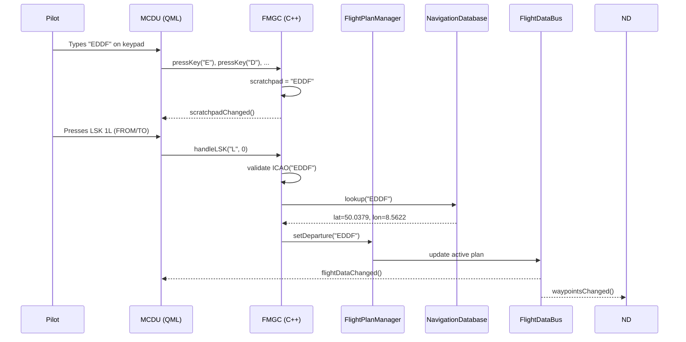
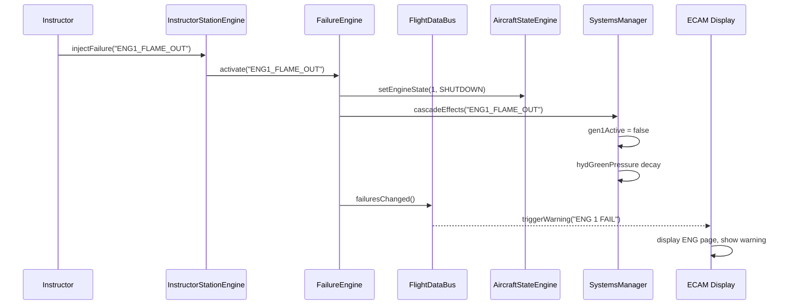
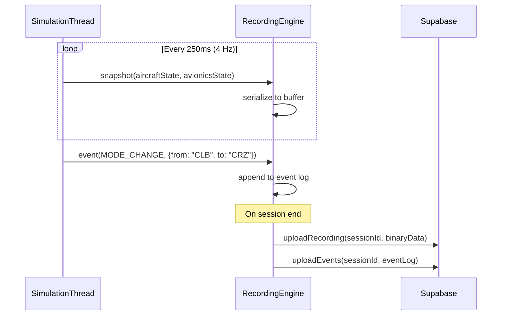

# 10 — Data Flow & API Architecture

## 1. Internal Data Flow (C++ → QML)

```mermaid
graph LR
    subgraph "Simulation Thread (12.5 Hz)"
        ASE[AircraftStateEngine] --> |"6DOF integration"| BUS[FlightDataBus]
        ENG[EngineModel] --> BUS
        SYS[SystemsManager] --> BUS
        AP[AutopilotController] --> BUS
        FPM[FlightPlanManager] --> |"1 Hz predictions"| BUS
    end

    subgraph "FlightDataBus (mutex-protected)"
        BUS --> |"Q_PROPERTY notify"| QML
    end

    subgraph "QML UI Thread"
        QML --> PFD[PFD Display]
        QML --> ND[ND Display]
        QML --> MCDU[MCDU Display]
        QML --> ECAM[ECAM Display]
        QML --> OHP[Overhead Panel]
        QML --> FCU_UI[FCU Panel]
    end

    subgraph "User Input (QML → C++)"
        FCU_UI --> |"Q_INVOKABLE"| AP
        MCDU --> |"pressKey/handleLSK"| FMGC[FMGC]
        OHP --> |"setSwitch"| SYS
        YOKE[Yoke/Pedals] --> |"setSidestick"| ASE
        THR[Throttle] --> |"setThrottle"| ENG
    end
```



## 2. MCDU Data Flow



## 3. Failure Injection Data Flow



## 4. Recording Data Flow



## 5. External API Architecture (Future)

### 5.1 REST API Endpoints

```
Authentication:
  POST   /api/auth/login
  POST   /api/auth/register
  POST   /api/auth/refresh

Users:
  GET    /api/users/me
  PUT    /api/users/me
  GET    /api/users/:id/stats

Organizations:
  GET    /api/orgs
  POST   /api/orgs
  GET    /api/orgs/:id/members
  POST   /api/orgs/:id/members

Training:
  POST   /api/sessions                     # start session
  PUT    /api/sessions/:id                  # update/end session
  GET    /api/sessions/:id                  # get session details
  GET    /api/sessions/:id/recording        # get recording
  GET    /api/sessions/:id/events           # get event log
  POST   /api/sessions/:id/assess           # submit assessment

Scenarios:
  GET    /api/scenarios
  POST   /api/scenarios
  PUT    /api/scenarios/:id
  GET    /api/scenarios/:id

Navigation:
  GET    /api/nav/airports?search=EDDF
  GET    /api/nav/airports/:icao/procedures
  GET    /api/nav/waypoints?search=OBOKA
  GET    /api/nav/airways?search=UL607
  GET    /api/nav/airac/current

Analytics:
  GET    /api/analytics/student/:id/progress
  GET    /api/analytics/student/:id/scores
  GET    /api/analytics/org/:id/dashboard
```

### 5.2 WebSocket Messages (Multi-User)

```
Channel: /sim/{sessionId}

Messages:
  → state.update      (4 Hz aircraft state sync)
  → event.pilot       (pilot input events)
  → event.instructor  (instructor commands)
  → failure.inject    (failure injection)
  → failure.clear     (failure clearance)
  → session.control   (freeze/unfreeze/reset)
  → chat.message      (instructor-student chat)
```

## 6. Communication Architecture (ARINC 429 Conceptual)

### 6.1 ARINC 429 Word Binary Structure
Real Airbus avionics communicate via unidirectional 32-bit ARINC 429 words. The layout of each word is:

```
┌────┬────┬───────┬──────────────────────────────────────────┬──────┬─────────┐
│ 32 │ 31 │ 30-29 │ 28                                    9 │ 8-7  │ 6     1 │
│ P  │ SSM│  SDI  │                 DATA                     │ SDI  │  LABEL  │
└────┴────┴───────┴──────────────────────────────────────────┴──────┴─────────┘
```
* **Bit 32: Parity (P)**: Odd parity check bit.
* **Bits 31-30: Sign/Status Matrix (SSM)**: Indicates operational status (No Computed Data [NCD], Failure Warning [FW], Normal Operation [NO]).
* **Bits 29-9: Data Field**: Contains binary coded decimal (BCD) or two's complement binary fractional (BNR) value.
* **Bits 8-7: Source/Destination Identifier (SDI)**: Specifies which receiver the message targets.
* **Bits 6-1: Label (Octal)**: Identifies the parameter type.

### 6.2 Expanded ARINC 429 Label Registry
To support traceability to real-aircraft data flows, the platform maps incoming simulated state bytes to the following ARINC 429 labels:

| Octal Label | parameter Name | Unit | Scale (Range) | DataBus Path |
|-------------|----------------|------|---------------|--------------|
| 012 | Computed Airspeed (CAS)| kt | 0 to 512 | `bus.aircraft.velocity.ias` |
| 014 | Mach Number | dimensionless | 0.0 to 1.0 | `bus.aircraft.velocity.mach` |
| 035 | Baro Corrected Altitude | ft | -1000 to 50000 | `bus.aircraft.position.altPressure` |
| 060 | Vertical Speed | ft/min | -20000 to 20000 | `bus.aircraft.velocity.vs` |
| 101 | Selected Airspeed | kt | 100 to 399 | `bus.avionics.ap.selectedSpeed` |
| 102 | Selected Heading | deg magnetic | 0 to 359 | `bus.avionics.ap.selectedHeading` |
| 103 | Selected Altitude | ft | 0 to 49000 | `bus.avionics.ap.selectedAltitude` |
| 150 | Aerodynamic Angle of Attack | deg | -20 to 40 | `bus.aircraft.aero.alpha` |
| 151 | Sideslip Angle | deg | -15 to 15 | `bus.aircraft.aero.beta` |
| 201 | Autopilot Lateral Mode | enum | Bitfield flags | `bus.avionics.ap.lateralMode` |
| 202 | Autopilot Vertical Mode | enum | Bitfield flags | `bus.avionics.ap.verticalMode` |
| 324 | Pitch Angle | deg | -90 to 90 | `bus.aircraft.attitude.pitch` |
| 325 | Roll Angle | deg | -180 to 180 | `bus.aircraft.attitude.roll` |
| 344 | Radio Altitude | ft | -20 to 2500 | `bus.aircraft.position.altRadio` |

### 6.3 Conceptual Parser in C++
Although we use high-speed C++ variables and Qt signals/slots for local simulation performance, the data interface is modeled using a bitwise mapping structure to allow future hardware-in-the-loop (HIL) physical ARINC 429 transceiver card integration (e.g. Ballard or Holt PCI card):

```cpp
struct ArincWord {
    uint32_t rawWord;

    // Decode Label (Bits 1-8 are inverted in standard ARINC 429 ordering)
    uint8_t getLabel() const {
        uint8_t reversed = rawWord & 0xFF;
        // Reverse bits to read correct Octal format
        uint8_t octal = 0;
        for (int i = 0; i < 8; ++i) {
            if (reversed & (1 << i)) {
                octal |= (1 << (7 - i));
            }
        }
        return octal;
    }

    // Decode BNR two's-complement value
    double getBnrValue(int startBit, int numBits, double scaleFactor) const {
        uint32_t mask = (1 << numBits) - 1;
        uint32_t dataBits = (rawWord >> (startBit - 1)) & mask;
        
        // Sign extend if negative
        bool isNegative = dataBits & (1 << (numBits - 1));
        int32_t value = dataBits;
        if (isNegative) {
            value |= ~mask;
        }
        return static_cast<double>(value) * scaleFactor;
    }
};
```
